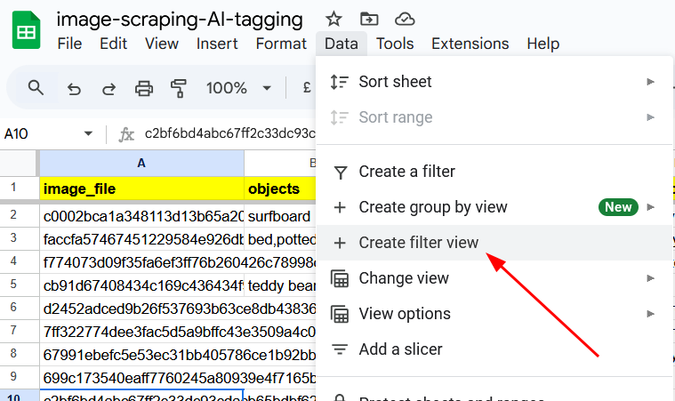

# [Project-name]
- The project is on a [Google Sheet](https://docs.google.com/spreadsheets/d/1bL2DR6-40eibcSMPtQXXu_RxWYKfQ-ifLzYuWQiftU4/edit?gid=674136501#gid=674136501), you can filter the images on there.
- What problems does this project solve ?
    - It scrape the wallpaper (used for home decoration) from https://holdendecor.co.uk/
- How does the project solve the problems? -> 2 Steps
    - Scrape the data
    - Tagging the data with AI (Image Processing and Object Detection)
- What skills do I want to show ?
    - The tools: scrapy, ultralytics, pandas, YOLO, numpy
    - The techniques: OOP, Image Processing, Web Scraping

# How to use the image filter
- Step 0: Download and unzip the [images folder](https://drive.google.com/file/d/1Gpa1YBv2OlN239qLmjFwyiw_Ft22uPOW/view?usp=sharing)
- Step 1: Access the [Google Spreadsheet](https://docs.google.com/spreadsheets/d/1bL2DR6-40eibcSMPtQXXu_RxWYKfQ-ifLzYuWQiftU4/edit?usp=sharing), Create a your own Filter View

- Step 2: Filter on your criteria
- Step 3: Check the images using the original links, or in the unziped folder
